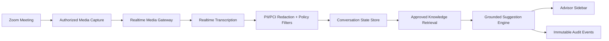

# RJ Realtime Advisor Assist

Enterprise-grade realtime assistant for financial advisors on Zoom calls.

The system captures authorized Zoom meeting media, transcribes it in near real time,
detects client intent and risk signals, and shows grounded advisor suggestions in a
secure sidebar. It is designed for financial-services review standards: consent,
auditability, data minimization, retrieval-grounded output, and human-in-the-loop use.

## Challenge Goal

Build a Raymond James engineering challenge prototype that demonstrates:

- Authorized realtime Zoom audio ingestion between clients and advisors.
- Low-latency transcription and speaker-aware conversation state.
- A sidebar for advisors with suggestions, objections, next-best questions, and compliance reminders.
- A no-hallucination posture: every suggestion must be grounded in approved knowledge, call context, or marked unavailable.
- Enterprise controls suitable for financial services.

## Recommended Architecture



## Run the Concept POC

This repo includes a zero-install local POC that simulates Zoom transcript events
and proves the core product loop: listen quietly, let the advisor ask for help,
then answer using the conversation so far, approved demo knowledge, and mocked RJ
CRM context.

Use the bundled or system Node.js runtime:

```bash
npm start
```

If `npm` is unavailable, run the server directly:

```bash
node services/poc-server/server.js
```

Then open:

```text
http://localhost:4173
```

Click **Start Demo** to stream the simulated call. The sidebar stays in listening
mode. Click **Ask Assist** and choose **What should I ask next?** to see a grounded
answer based on the conversation so far.

The browser demo is static-friendly and can also run from
`apps/advisor-sidebar/public` on GitHub Pages. It intentionally uses deterministic
matching against `data/approved-knowledge.json` and a mocked profile at
`data/crm-client-profile.json`. It does not call an LLM yet. This keeps the first
demo fully inspectable before adding model generation.

## Share The Demo

The repo includes a GitHub Actions workflow at
`.github/workflows/deploy-pages.yml` that publishes
`apps/advisor-sidebar/public` to GitHub Pages.

To share with a reviewer:

1. In GitHub, open the repository settings.
2. Go to **Pages**.
3. Set the source to **GitHub Actions**.
4. Run the `Deploy static advisor POC` workflow or push to `main`.
5. Share the Pages URL when the workflow finishes.

If GitHub Pages is unavailable for the private repo, upload the
`apps/advisor-sidebar/public` folder to Netlify Drop, Vercel, or any static host.
The demo does not require server secrets.

## Run The Zoom Transcript Context POC

This repo also includes a second app for testing the next workflow: capture or
import a Zoom conversation transcript, then let the advisor ask a question using
conversation context, mocked RJ CRM data, approved knowledge, and a dated market
snapshot.

```bash
npm run start:transcript
```

Then open:

```text
http://localhost:4174
```

The browser POC supports simulated transcript streaming, pasted Zoom transcript
text, and browser mic dictation when available. Production Zoom capture should use
Zoom RTMS or an approved Meeting SDK/native capture path.

Run validation:

```bash
npm test
```

Or directly:

```bash
node tests/grounding.test.js
```

## Implementation Plan

1. Prove capture path with Zoom using the approved permission model.
   - Preferred for continuous media capture: Zoom Realtime Media Streams (RTMS).
   - Alternative for embedded/native SDK demos: Meeting SDK raw audio on supported platforms.

2. Build a realtime ingestion service.
   - Validate Zoom webhooks/events and stream signatures.
   - Normalize audio to the transcription provider format.
   - Emit ordered call events to a durable stream.

3. Add transcription and conversation state.
   - Use realtime transcription for low latency.
   - Preserve segment IDs, timestamps, speaker labels when available, and confidence.
   - Never rely on generated summaries as the only source of truth.

4. Build a grounded suggestion service.
   - Retrieve only from approved Raymond James policy/product/FAQ material.
   - Require citations or internal evidence IDs for every suggestion.
   - If confidence or grounding is insufficient, return "No supported suggestion."

5. Build the advisor sidebar.
   - Display live transcript, suggested prompts, next-best actions, risk alerts, and citations.
   - Keep advisor in control; no automatic client-facing advice.

6. Add enterprise controls from day one.
   - Consent capture and visible recording/AI disclosure.
   - Tenant isolation, least-privilege service accounts, encryption in transit and at rest.
   - Audit logs, retention policies, redaction, monitoring, and incident runbooks.

## No-Hallucination Strategy

The product cannot promise mathematical zero hallucination from an LLM. The engineering
standard is to prevent unsupported claims from reaching the advisor:

- Retrieval-required generation: no retrieved source, no advice.
- Structured outputs with evidence IDs, confidence, and policy classification.
- Deterministic validators after model output.
- Restricted financial language: suggestions are phrased as advisor prompts, not final advice.
- Human approval: sidebar assists the advisor; it does not speak to the client.
- Full audit trail: transcript segment, source IDs, model version, prompt version, and validation result.

## Initial Tech Stack

- Backend: TypeScript or Python services, depending on the chosen Zoom SDK path.
- Eventing: Kafka, Redpanda, or AWS Kinesis for ordered call events.
- Realtime transport to sidebar: WebSocket or Server-Sent Events.
- Storage: Postgres for metadata, object storage for encrypted artifacts, vector index for approved knowledge.
- Observability: OpenTelemetry traces, structured logs, metrics, and security audit events.
- Deployment: containerized services with IaC, secrets manager, CI policy gates, and SBOM generation.

## References

- Zoom Meeting SDK: https://developers.zoom.us/docs/meeting-sdk/
- Zoom Realtime Media Streams: https://developers.zoom.us/docs/rtms/
- Zoom RTMS SDKs: https://developers.zoom.us/docs/rtms/sdk/
- OpenAI Realtime transcription: https://platform.openai.com/docs/guides/realtime-transcription
